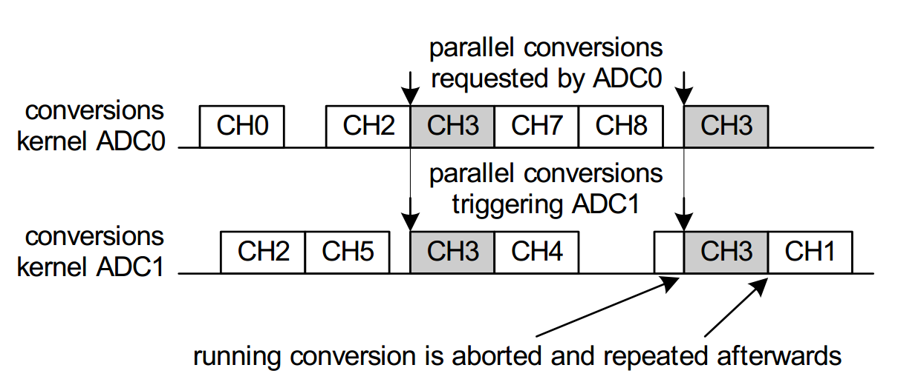

---
title: Your Meeting Title
author: Sebastian K. Mangelsen
date: 2015-XX-XX
toc-title: Table Of Content
version: 1.0
...


# Introduction

## Some Code Examples
Before starting work with GIT everyone should start with setting users name and email address
(refer to [section](#some-code-examples).

~~~~{.bash}
git config --global user.email "your@mail.com"
git config --global user.name "Name Surname"
~~~~
## Adding A Link
For more information refer to the [following article](https://git-scm.com/book/be/v2/Git-Basics-Undoing-Things).

> Note: Every amend operation will get its own SHA because every changed commit message or
file will always affect the SHA.

## Have Fun Writing Meeting Notes

Let's include an image and have some fun.




| IDABD  | Name | Surname | Address |
|----:|------|----- |----- |
|23 | Sebastian | Krueger Mangelsen | Eklanda Skog 27, 43149 Mölndal
|11 | Ina| Bloch | Inas Gränd 13, 43157 Göteborg
|11 | Ina| Geichberge | Inas Gränd 13, 43157 Göteborg
|11 | Ina| Läuthäuser Schnarrenberger | Inas Gränd 13, 43157 Göteborg

: lists all known user

| Name | Type | ID |
|--:|--|--|
| ABC | None | 23
| ABC | None | 23
| ABC | None | 23

: A shorter table in order to test how it scales.


## Codebox follows a new section, watch for margins

```python
def main():
   pass

if __name__ == "__main__":
   sys.exit(main())
```

## Write Inline Code
Sometimes it is required to write some inline code. It could be used to highlight
names as well. In Linux, one could make use of `nice` in order to change the 
scheduler priority for a certain binary.

   
